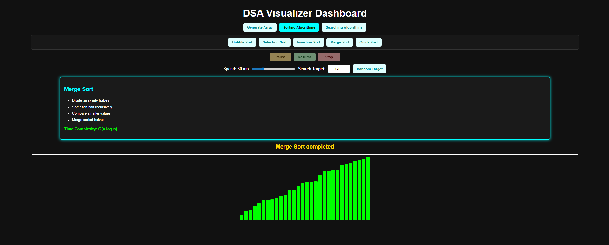

# DSA Visualizer Dashboard

A simple and interactive web-based visualizer for common Data Structures and Algorithms concepts. This project helps users understand how sorting and searching algorithms work step by step using animated array bars.



## Features

- Generate a random array of bars
- Visualize sorting algorithms
- Visualize searching algorithms
- Adjust animation speed
- Pause, resume, and stop a running algorithm
- Set a custom search target
- Generate a random search target from the current array
- Responsive layout for desktop and mobile screens

## Algorithms Included

### Sorting Algorithms

- Bubble Sort
- Selection Sort
- Insertion Sort
- Merge Sort
- Quick Sort

### Searching Algorithms

- Linear Search
- Binary Search
- Jump Search

> Note: Binary Search and Jump Search automatically sort the array before searching because both algorithms require sorted data.

## Tech Stack

- HTML
- CSS
- JavaScript

No external libraries or frameworks are required.

## Project Structure

```text
DSA-Algorithm-Visualizer/
|-- index.html
|-- style.css
|-- script.js
|-- assets/
|   `-- preview.png
`-- README.md
```

## How to Run

1. Download or clone this repository.

```bash
git clone https://github.com/ZainulSaifi147/DSA-Algorithm-Visualizer.git
```

2. Open the project folder.

```bash
cd DSA-Algorithm-Visualizer
```

3. Open `index.html` in your browser.

Since this is a static HTML, CSS, and JavaScript project, no installation is required.

## How to Use

1. Click `Generate Array` to create a new random array.
2. Choose either `Sorting Algorithms` or `Searching Algorithms`.
3. Select an algorithm to start the visualization.
4. Use the speed slider to control the animation speed.
5. Use `Pause`, `Resume`, and `Stop` while an algorithm is running.
6. For searching algorithms, enter a target value or click `Random Target`.

## Learning Goal

This project is designed to make DSA concepts easier to understand visually. Instead of only reading code or theory, users can watch how values are compared, swapped, divided, merged, and searched in real time.

## Future Improvements

- Add more algorithms such as Heap Sort, Radix Sort, and Exponential Search
- Add graph algorithms like BFS, DFS, and Dijkstra's Algorithm
- Display comparison and swap counts
- Add dark/light theme toggle
- Improve mobile controls

## Author

Created by **Zainul Saifi**.
